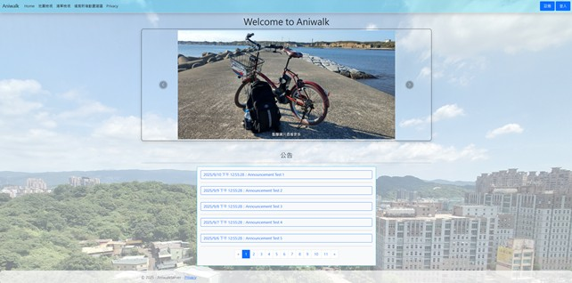

# Aniwalk - 聖地巡禮資訊分享平台

## 發想與製作動機
目前喜歡動漫畫已經是個非常普遍的興趣，很多人不僅喜歡觀賞動畫，更會親自前往每部動畫中實際繪製的地點進行朝聖，即所謂的「聖地巡禮」，並用相機記錄當下的感動，撰寫文章發布於網路上與同好分享。然而目前市場上缺乏一個能夠系統性整理聖地巡禮記錄的平台。絕大多數的動畫愛好者多仰賴傳統部落格、社群平台等工具來發布遊記，這些平台雖然普及，但缺乏針對動畫聖地巡禮所需的特殊功能，諸如景點與動畫場景對照、動畫作品分類等，使得資訊分散、檢索困難，也難以與其他同好交流或參考。

為了滿足動畫愛好者分享自己聖地巡禮的經歷，決定開發一個新的「聖地巡禮資訊分享平台」：一個結合地圖資訊、影像整理、貼文、動畫標記、與社群互動功能的整合性網站。使用者可透過地圖檢索或清單檢視快速瀏覽每個用戶所發布的聖地巡禮記錄；亦可自行上傳旅行中拍攝的照片、影片，並加入使用者自己的到訪經歷，與全世界的動畫愛好者分享。

此外，該平台也提供社群互動機制，用戶可在其他人的到訪紀錄下留下評論、留言，進一步建立起以動畫旅遊為核心的社群圈。透過這樣的系統，讓全世界的動畫愛好者可以更有系統地紀錄、分享並保存自己的聖地巡禮回憶，平台也能持續透過數據分析與用戶回饋進化，成為動漫與旅遊結合的創新應用服務。

## 簡介
此系統初期將要求使用者利用電腦網頁瀏覽器方可進行閱覽，待整體功能齊全完善後再朝向手機瀏覽器布局進行調整，甚至另外開發獨立的APP。

* 用途：專為動漫愛好者設計的聖地巡禮分享與交流平台
* 價值：系統化整理聖地巡禮資訊，解決目前資訊分散、難以檢索的問題，提升愛好者的分享與交流體驗。對於想進行聖地巡禮的人也能提供更便捷的規劃參考。
* 目的性：建立一個以動畫旅遊為核心的社群圈，促進全球動畫愛好者的交流，並作為聖地巡禮回憶的系統性保存庫。

## 功能描述
1.	會員新增聖地巡禮到訪紀錄
	1. 填入到訪紀錄的主文內容
	1. 填寫及指定到訪紀錄的相關資訊
	1. 照片上傳
	1. 填寫照片說明
2.	會員評論&留言回覆功能
	1. 在其他會員的到訪紀錄下寫下評論
	1. 在評論下留下回覆
	1. 修改評論&回覆
	1. 刪除評論&回覆
3.	使用者到訪紀錄檢索
	1. 在地圖上瀏覽
	1. 在清單上瀏覽
	1. 輸入篩選條件
4. 其他會員功能
	1. 註冊
	1. 登入
	1. 個人資訊流覽, 修改
	1. 忘記密碼流程
	1. 會員新增動畫建議：新增到訪紀錄時如果沒有對應的動畫分類，可填寫回饋單以請求管理團隊新增該動畫分類
6.	管理者功能
	1. 檢視新增\核准\否決動畫分類建議
	1.	新增\管理動畫分類
	1.發布\編輯公告
	1. 檢視\管理會員資訊
	1. 檢視\管理到訪紀錄
	1. 檢視\刪除評論&回覆

## 技術參考
[[day2]-創造自己的地圖服務應用，Google Maps API的概念篇](https://ithelp.ithome.com.tw/articles/10190718)

## 專案Demo
[Aniwalk](https://aniwalk-33239113606.asia-east1.run.app)

### 測試帳號 (帳密皆相同)
#### 管理員  
* admin
#### 會員  
* 02345678
* 12345678
* 22345678